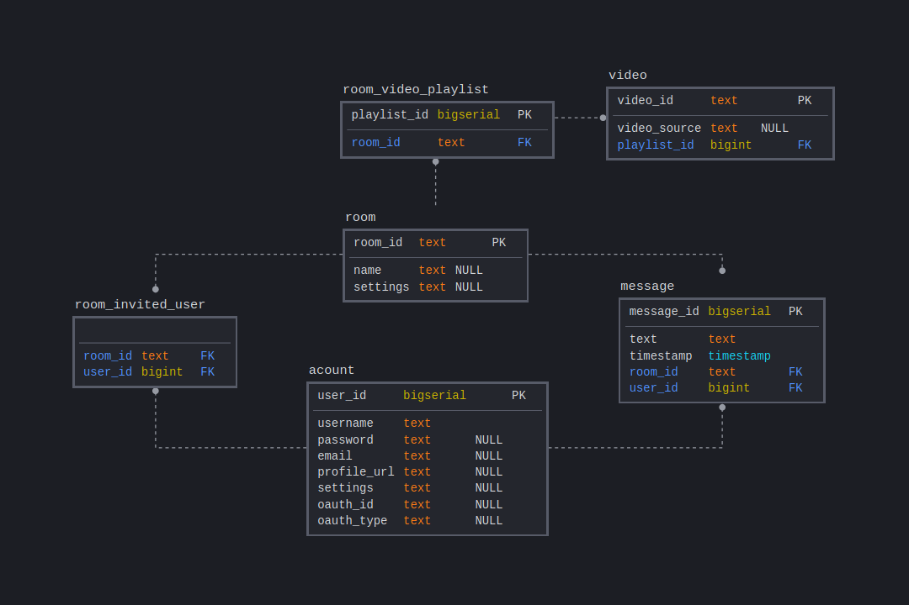

# Flix With Friends


# Heroku Link:
[Flix With Friends](https://flix-with-friends.herokuapp.com/)

Watch videos with friends at the same time remotely!

# Sections:
1. [Installation](#user-content-installation)
2. [Socket.io Events](#user-content-socketio-events)
3. [Database Schema](#user-content-database-schema)
4. [Individualized Work Information](#user-content-individualized-work-information)

---

# Installation

0. `git clone https://github.com/gpeppel/flix-with-friends.git`
1. Install requirements
```bash
npm install
pip install -r requirements.txt
```

## Setting up PSQL

1. Install PostgreSQL:
```bash
sudo yum install postgresql postgresql-server postgresql-devel postgresql-contrib postgresql-docs
```
2. Set up PostgreSQL:
```bash
sudo service postgresql initdb
sudo service postgresql start
sudo -u postgres createuser --superuser <username>
sudo -u postgres createdb <db name>
```
n a terminal, run `psql` and use these commands (replace username and password):
```
create user <username> superuser password '<password>';
\q
```
Create `sql.env` and put the username and password set above.
```bash
DATABASE_URI='postgresql://<username>:<password>@localhost/<db name>'
```

---

Run code:
`npm run build && python app.py`

---

# Socketio Events
### message_new
*Server-to-Client*

Send new chat messages to clients.

Data:
```
{
    "messages": [
        {
            "id": string,
            "text": string,
            "user": {
                "id": string,
                "name": string
            },
            "timestamp": int
        }
    ]
}
```
---
### message_send
*Client-to-Server*

Send a message to the server.

Data:
```
{
	"text": string
}
```
---
### login_oauth_facebook
*Client-to-Server*

Login request using Facebook OAuth.

Data:
```
{
	"response": {
		"accessToken": string,
		"name": string,
		"email": string,
		"picture": {
			"data": {
				"url": string
			}
		},
		"id": int
	}
}
```

Callback data:
```
{
	"status": "ok" | "fail",
	"userId": string
}
```
---
### login_oauth_google
*Client-to-Server*

Login request using Google OAuth.

Data:
```
{
	"token": string,
	"username": string
}
```

Callback data:
```
{
	"status": "ok" | "fail",
	"userId": string
}
```
---
### room_create
*Client-to-Server*

User request to create a new room.

Data:
```
{
	"roomName": string
}
```

Callback data:
```
{
	"status": "ok" | "fail",
	"roomId": string,
	"roomName": string
}
```
---
### room_join
*Client-to-Server*

User request to join an existing room.

Data:
```
{
	"roomId": string
}
```

Callback data:
```
{
	"status": "ok" | "fail",
	"error": "noexist" | undefined
}
```
---
### user_join
*Server-to-Client*

New user has joined the room.

Data:
```
{
	"user": {
		"id": string,
		"name": string
	}
}
```
---
### user_leave
*Server-to-Client*

User has left the room.

Data:
```
{
	"user": {
		"id": string,
		"name": string
	}
}
```
---
### yt_load
*Client-to-Server, Server-to-Client*

Load the video info.

Data:
```
{
	"height": int,
	"width": int,
	"videoId": string,
	"offset": int
}
```
---
### yt_sphere_update
*Client-to-Server, Server-to-Client*

Sync the 360 degree video view.

Data:
```
{
	"properties": {
		"yaw": float,
		"pitch": float,
		"roll": float,
		"fov": float
	}
}
```
---
### yt_state_change
*Client-to-Server, Server-to-Client*

Change the video state.

Data:
```
{
	"state": "ready" | "unstarted" | "ended" | "playing" | "paused" | "buffering" | "cued" | "playback",
	"sender": string,
	"offset": float,
	"rate": float,
	"runAt": int,
	"timestamp": string
}
```

---

# Database Schema


# Individualized Work Information
Avkash Patel:

* Worked on setting up the viewing room

* Made room URL a sharable link through a copy button

* Was unable to create multiple individualized rooms, so user story was moved to Sprint 2

* Helped with styling for login page and viewing room

* Changed logic so that viewing room creation is only possible if Facebook login is passed

---

Greg Peppel:

For the most part, we collaborated on lots of different parts of the project. Specifically, I felt I was most responsible for the overall design (look and feel) of the project. I also worked on connecting the technologies such as heroku and the facebook developer and getting them to talk to our project. Things I also was apart of:

* Facebook button and connecting the login functionality
* Overall css and styling of the project (also art assets logo, buttons, etc.)

Things that are incomplete

* Adding a google login button
* Overall css of the chat window and chat box

---

Daniel Vergilis:
- Wrote the YouTube IFrame Embed API code that syncs the videos between users
- Wrote skeleton backend server code
- Wrote test cases
- Used linter for source code
- Set up Travis CI configuration

Incomplete:
- Complete coverage, all working test cases
- Better syncing when buffering
- Host-priority sync mode

---

Matt Gonzalez:
* Set up chat functionality
* Integrated Facebook user info into chat frontend
* Added simple styling to chat sidebar and messages
* Helped with general backend logic
